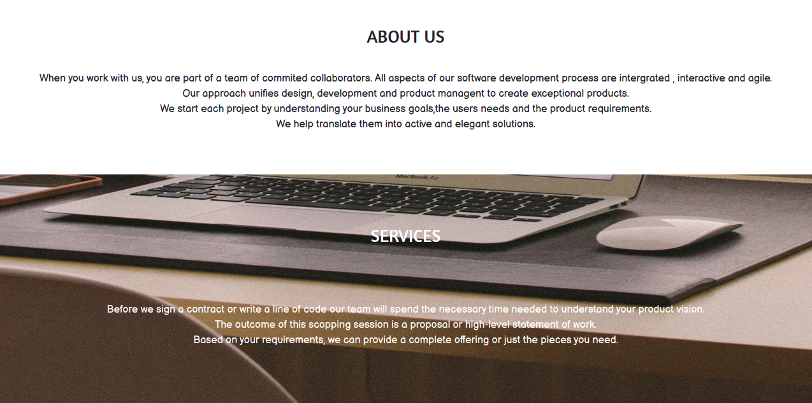
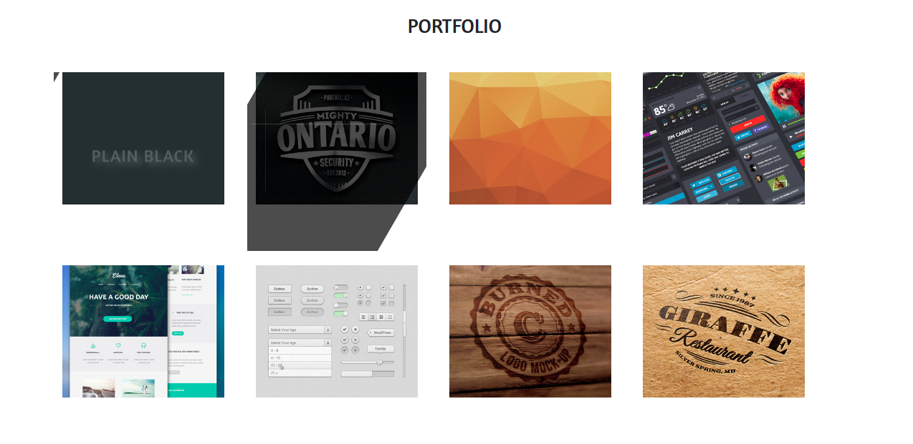

## Table of Contents

- Project Title
- Description
- Deployment
- BDD (Behaviour Driven Development)
- Project Preview
- Technologies used
- Bugs
- Acknowledgement
- Licence
- Contacts
- Author

# Delani Studio

## DESCRIPTION

- This website is a landing page of Delani studios. It explains and showcases what Delani is all about.

## Deployment

- You can vist the site directly by clicking [HERE](https://mrbrianomollo.github.io/delani-studio/)
- You can view the source code on github [HERE](https://github.com/mrbrianomollo/delani-studio)

## BDD

> Incase you need to contact them you will be required to  fill out the contact form and your details will be captured.

## Project Screenshot

- This is the first thing you see once you open the landing page. Has the name and logo of Delani Studios.

- This th e about us section and services. Gives a brief description on delani and goes further to let you know what services they offer.

- This sections has details of what Delani actually does. The thumbnails are clickable to explain further.

- This section Delani actually showcases their works and projects.

- This section is what prospective customers use to contact them. You like what you saw? Drop them an email.

- Delani is social and thats why you can find them across the listed platforms on the footer.

## Technologies Used

- html
- css
- javascript
- bootsrap

## Bugs

- None at the moment

## Acknowledgement

I would like to thank different content providers on youtube for enabling me to come up with this project.

## Contacts

Incase of any feedback you can reach me through my personal contacts:

- mrbrianomollo@gmail.com
- 0723670846

## Author

> **Brian Ongati**
